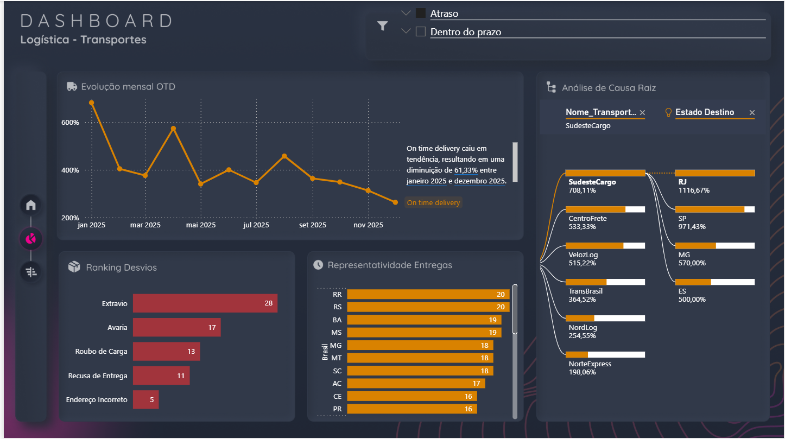

# Dashboard-logistica-powerbi
Nesse desafio foi criado um dashboard financeiro de logistica.
Respondemos perguntas como :

📊 Qual foi a evolução do OTD?
📊 Qual transportadora está dentro do prazo?
📊  Qual cidade  está tendo mais entregas?
📊 Quantos desvios?

Durante o desenvolvimento, passamos por algumas etapas importantes:

🔹 Importação dos dados a partir do Excel 
 
🔹 Tratamento e limpeza dos dados no Power Query 

🔹 Criação do layout no figma e importação para o Power BI como template.

🔹Medidas Dax

🔹Relacionamento entre uma página e outra do dashboard, quando clica no ícone de home.

